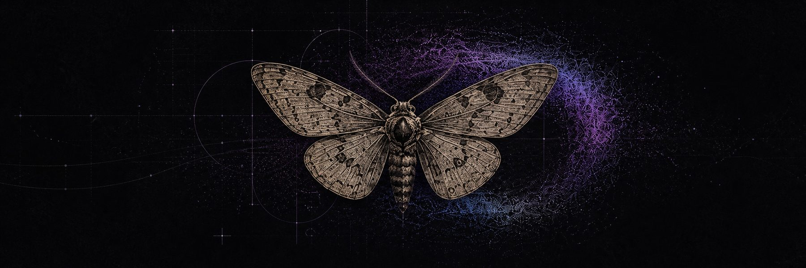
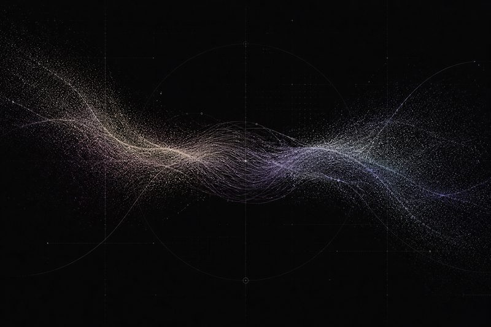
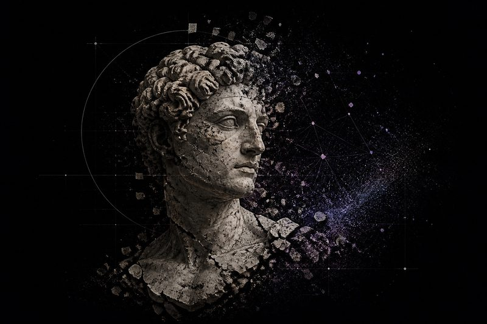
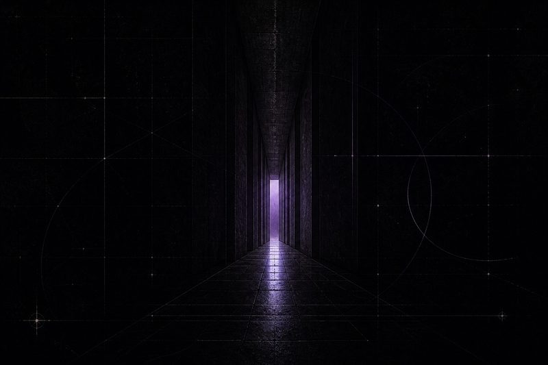
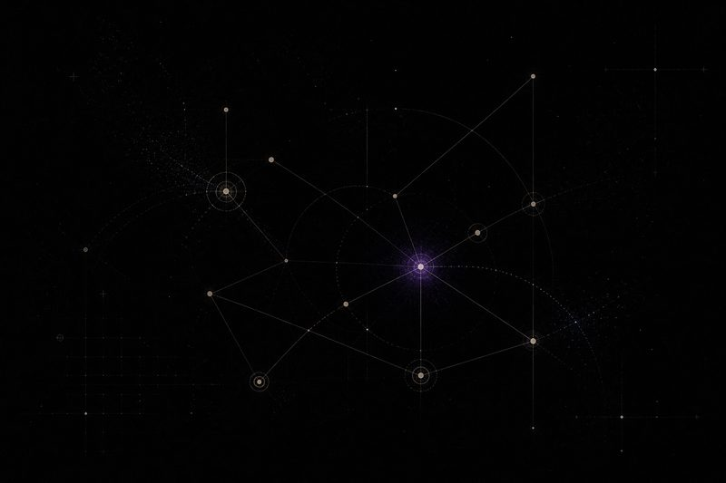
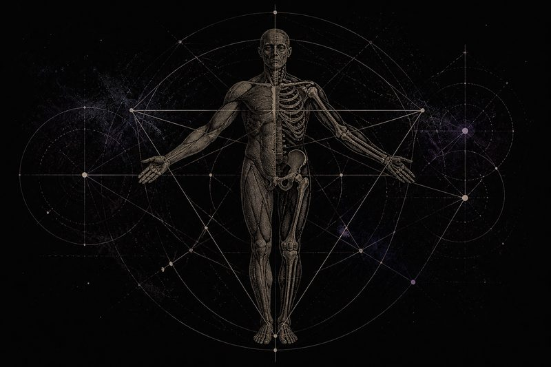
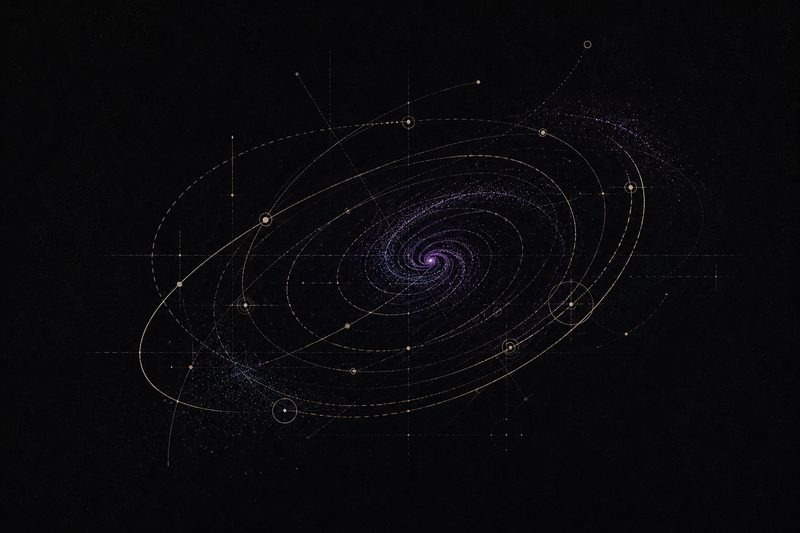

<table>
  <tr>
    <td><strong>apofenia7 / mateus</strong></td>
    <td align="right">PATTERNS &nbsp;·&nbsp; MINDS &nbsp;·&nbsp; MACHINES &nbsp;·&nbsp; VALUE</td>
  </tr>
</table>

  

<h1 align="center">mateus</h1>

  <em>Patterns, minds, machines and things we decide are valuable.</em>

  <a href="https://mateus-site-ebon.vercel.app">website ↗</a>
  &nbsp;&nbsp;·&nbsp;&nbsp;
  <a href="https://apofenia.art">apofenia ↗</a>
  &nbsp;&nbsp;·&nbsp;&nbsp;
  <a href="https://alternamentesaude.com">alternamente ↗</a>

 

<table>
  <tr>
    <td width="40%" valign="top">
      SIGNAL → PATTERN → MEANING → VALUE
    </td>
    <td width="60%" valign="top">
      I investigate how people perceive, decide, care, create and assign value — then build systems around those questions.
    </td>
  </tr>
</table>

  MIND &amp; CARE &nbsp;&nbsp;·&nbsp;&nbsp; CULTURE &amp; VALUE &nbsp;&nbsp;·&nbsp;&nbsp; MACHINES &amp; INTERFACES &nbsp;&nbsp;·&nbsp;&nbsp; SYSTEMS &amp; RESEARCH

## Systems & projects

Building systems that expand clarity, autonomy and meaning.

  

<table>
  <tr>
    <td width="33.333%" valign="top">
      
      <h3><a href="https://alternamentesaude.com">Alternamente ↗</a></h3>
      
Systems for care and clinical work, designed to increase clarity without displacing responsibility.

      CARE · SYSTEMS
    </td>
    <td width="33.333%" valign="top">
      
      <h3><a href="https://apofenia.art">Apofenia ↗</a></h3>
      
Culture, intellectual property and the systems through which creative work becomes legible and valued.

      CULTURE · IP · VALUE
    </td>
    <td width="33.333%" valign="top">
      
      <h3>Mateus OS</h3>
      
Personal infrastructure for thinking, deciding and executing with less friction.

      TOOLS · DECISIONS
    </td>
  </tr>
  <tr>
    <td width="33.333%" valign="top">
      
      <h3>AI Lab</h3>
      
Explorations in agents, models, data and interfaces for complex human work.

      AGENTS · MODELS · INTERFACES
    </td>
    <td width="33.333%" valign="top">
      
      <h3>Juris · Eng · Med</h3>
      
Applied research where medicine, engineering and law intersect.

      APPLIED RESEARCH
    </td>
    <td width="33.333%" valign="top">
      
      <h3>Experiments</h3>
      
Notes, prototypes and unfinished ideas kept visible while they take form.

      NOTES · PROTOTYPES
    </td>
  </tr>
</table>

Some of this work lives in private repositories by design.

## Current questions

OPEN LINES OF WORK &nbsp;·&nbsp; NOTHING PUBLISHED YET

  Perception &nbsp;·&nbsp; Adaptation &nbsp;·&nbsp; Signal &nbsp;·&nbsp; Value &nbsp;·&nbsp; Interfaces &nbsp;·&nbsp; Embodiment

 

  <em>perceber é o início. &nbsp; decidir é o meio. &nbsp; construir é o método. &nbsp; valor é o propósito.</em>

