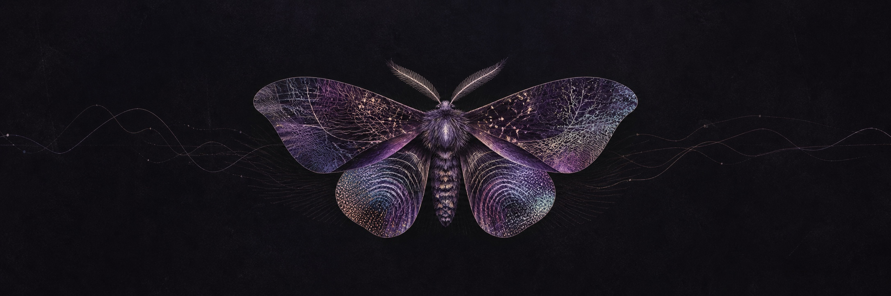

  

<h1 align="center">mateus</h1>

  <em>Patterns, minds, machines and things we decide are valuable.</em>

  <a href="https://mateus-site-ebon.vercel.app">website</a>
  &nbsp;·&nbsp;
  <a href="https://apofenia.art">apofenia</a>
  &nbsp;·&nbsp;
  <a href="https://alternamentesaude.com">alternamente</a>

---

I investigate how people perceive, decide, care, create and assign value — then build systems around those questions.

## 01 / areas

**Mind & care**  
Mental health, care infrastructure and tools that keep responsibility with people.

**Culture & value**  
Art, music, intellectual property and the ways cultural work becomes legible and valued.

**Machines & interfaces**  
AI, agents and clear tools for complex human work.

**Systems & research**  
Writing, code, prototypes and applied inquiry across disciplines.

## 02 / systems

**Práxis Care**  
Systems for care and clinical work.

**Apofenia**  
Culture, intellectual property and systems of value.

**Mateus OS**  
Personal infrastructure for thought, decisions and execution.

**AI Lab**  
Experiments with agents, models and interfaces.

**Juris · Eng · Med**  
Applied research across medicine, engineering and law.

Some of this work lives in private repositories by design.
